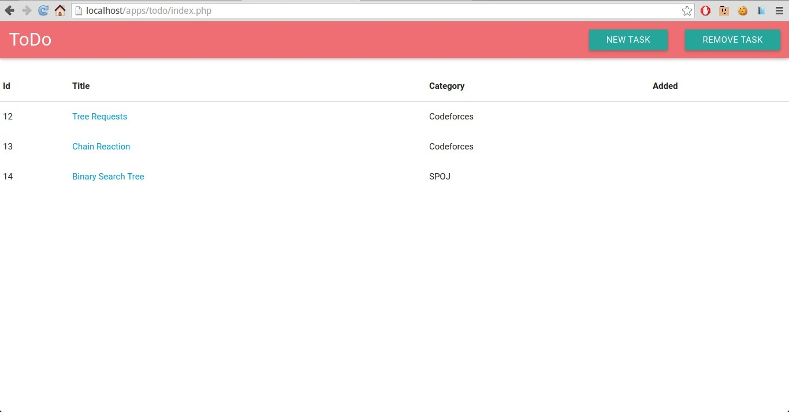
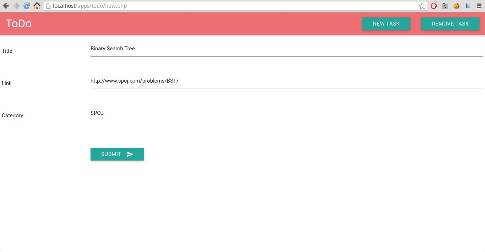

# ToDo-unsolved  [ Not Yet Completed ] . Commited for Backup purpose.
Keep Track of your Codeforces Unsolved probelms and can also be used as ToDo app [ Local-Hosted ]

**Not  yet Completed**

**Highlights**

* Automatically fetches your unsolved problems from Various Online Judges

